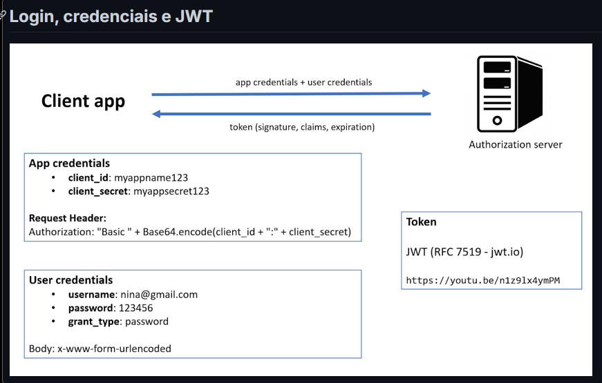
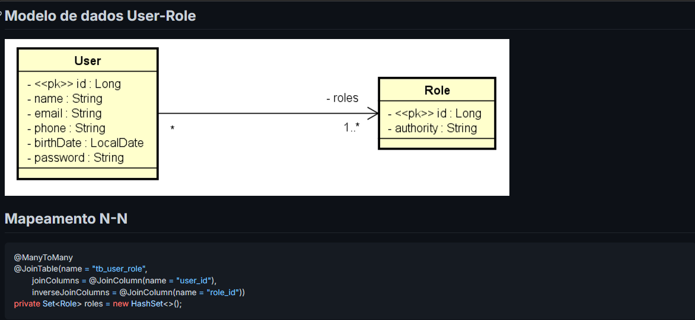
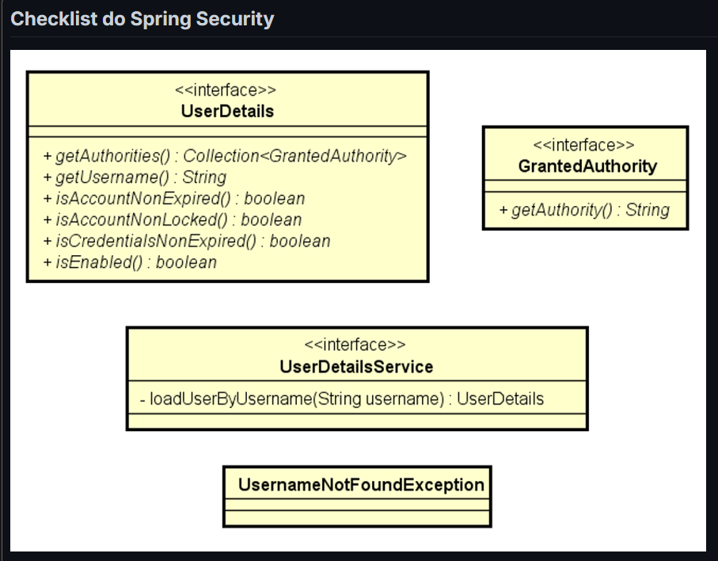
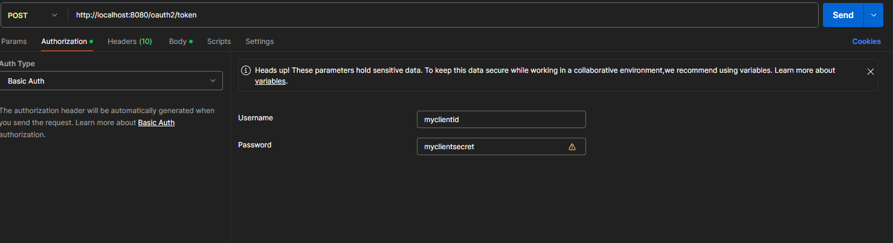
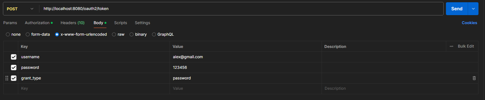
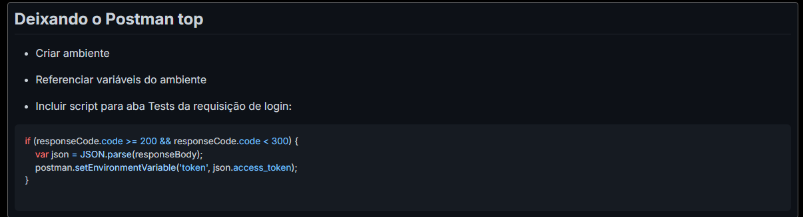

# AUTH REFERENCE

---

- **client_id** e **client_secret** estão configurados no `application.properties`

* User credentials não é no formado JSON e sim uriencode, são as credencias do usuário salvos no banco de dados





- UserDetailsProjection.java

```
public interface UserDetailsProjection {

	String getUsername();
	String getPassword();
	Long getRoleId();
	String getAuthority();
}
```

- Consulta nativa no UserRepository
  - Busca com SQL para performar melhor, evita configurar a entidade com **eager**(já que many to many é padrão lazy), evita também o JOIN FETCH do JPQL

```
@Query(nativeQuery = true, value = """
			SELECT tb_user.email AS username, tb_user.password, tb_role.id AS roleId, tb_role.authority
			FROM tb_user
			INNER JOIN tb_user_role ON tb_user.id = tb_user_role.user_id
			INNER JOIN tb_role ON tb_role.id = tb_user_role.role_id
			WHERE tb_user.email = :email
		""")
List<UserDetailsProjection> searchUserAndRolesByEmail(String email);
```

- Liberando provisoriamente os endpoints

```
@Configuration
public class SecurityConfig {
	@Bean
	public SecurityFilterChain filterChain(HttpSecurity http) throws Exception {
		http.csrf(csrf -> csrf.disable());
		http.authorizeHttpRequests(auth -> auth.anyRequest().permitAll());
		return http.build();
	}

	// Filtro do H2 para Spring Security
	@Bean
	@Profile("test")
	@Order(1)
	public SecurityFilterChain h2SecurityFilterChain(HttpSecurity http) throws Exception {

		http.securityMatcher(PathRequest.toH2Console()).csrf(csrf -> csrf.disable())
				.headers(headers -> headers.frameOptions(frameOptions -> frameOptions.disable()));
		return http.build();
	}
}
```

- Checklist OAuth2 JWT password grant
  - `application.properties`

```
security.client-id=${CLIENT_ID:myclientid}
security.client-secret=${CLIENT_SECRET:myclientsecret}

security.jwt.duration=${JWT_DURATION:86400}

cors.origins=${CORS_ORIGINS:http://localhost:3000,http://localhost:5173}
```

- Checklist OAuth2 JWT password grant
  - Implementação customizada do password grant
  - Authorization server
  - Habilitar Authorization server
  - Configurar token (codificação, formato, assinatura)
  - Configurar autenticação / password encoder
  - Registrar aplicação cliente
  - Resource server
  - Configurar controle de acesso aos recursos
  - Configurar CSRF, CORS
  - Configurar token
  - Liberar H2 Console no modo teste

* Testando no postman, gera automaticamente um header com a authorization(request header), após informar o username e password na aba authorization do postman
  
  
  
